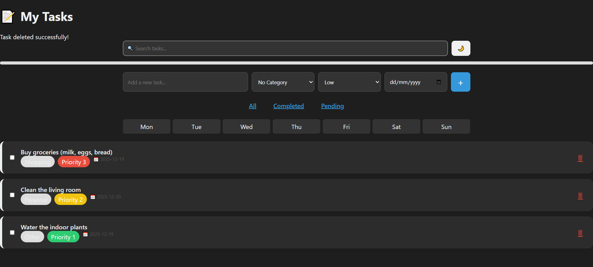

# Flask To-Do List Application

A simple web-based task management application built with Flask framework that allows users to create, view, update, and delete tasks.

## UI Preview


## Features

- Create new tasks
- View all tasks
- Edit existing tasks
- Delete tasks
- Tasks sorted by creation date
- Clean and responsive user interface

## Technology Stack

- **Backend**: Python 3.x, Flask
- **Database**: SQLite
- **ORM**: SQLAlchemy
- **Template Engine**: Jinja2

## Installation and Setup

### Prerequisites

- Python 3.6 or higher
- pip (Python package manager)

### Step 1: Clone the Repository

```bash
git clone https://github.com/slamaniabdelhafid/Flask-To-Do-List-WebApp
cd flask-todo-app
```

### Step 2: Create and Activate Virtual Environment

**For Windows:**

```bash
python -m venv venv
venv\Scripts\activate
```

**For macOS/Linux:**

```bash
python3 -m venv venv
source venv/bin/activate
```

### Step 3: Install Dependencies

```bash
pip install -r requirements.txt
```

If requirements.txt doesn't exist, install the packages manually:

```bash
pip install flask flask-sqlalchemy
```


### Step 4: Run the Application

```bash
python app.py
```

The application will be running at `http://127.0.0.1:5000/`


## API Endpoints

- `GET /` - Display all tasks
- `POST /` - Create a new task
- `GET /delete/<id>` - Delete a task
- `GET /update/<id>` - Display update form for a task
- `POST /update/<id>` - Update a task

## Database Schema

The Todo model has the following fields:
- `id`: Integer (Primary Key)
- `content`: String (200 characters, Not Null)
- `completed`: Integer (Default: 0)
- `pub_date`: DateTime (Default: Current UTC time)


## License

This project is licensed under the MIT License - see the LICENSE file for details.
